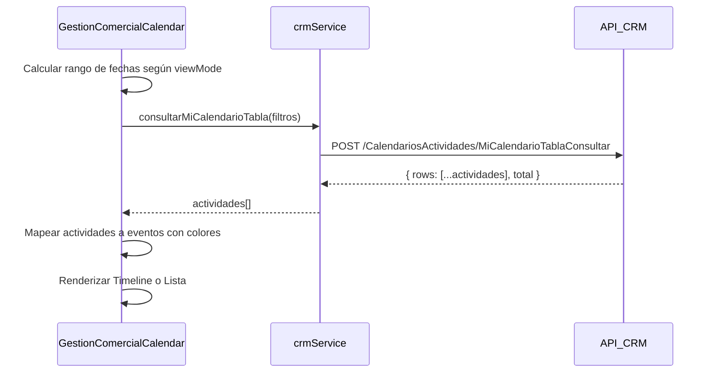

# Documentación: Mi Calendario de Actividades

## Resumen

El componente **GestionComercialCalendar** muestra las actividades del calendario del usuario actual en la aplicación móvil. Soporta dos modos de visualización: **Timeline** (vista por día con línea de tiempo) y **Lista** (vista por mes).

**Ubicación del código:** `src/features/crm/components/GestionComercialCalendar.jsx`

---

## Endpoint Principal

### `MiCalendarioTablaConsultar`

| Campo        | Valor                                                                      |
| ------------ | -------------------------------------------------------------------------- |
| **URL**      | `{BASE_URL}/API_CRM/api/CalendariosActividades/MiCalendarioTablaConsultar` |
| **Método**   | `POST`                                                                     |
| **API**      | `API_CRM`                                                                  |
| **Servicio** | `crmService.consultarMiCalendarioTabla(filtros)`                           |
| **Línea**    | `crmService.js:200-222`                                                    |

#### Parámetros del Request

```json
{
  "Page": 1,
  "Rows": 100,
  "EstadoActividadID": "3,4", // Por defecto: Vigentes y Vencidas
  "SucursalID": 1, // ID de sucursal del usuario
  "TipoCalendarioActividadID": null,
  "UsuarioID": 123, // ID del usuario/asesor a filtrar
  "Usuario": "Nombre Usuario", // Nombre del usuario actual
  "EmpresaID": null,
  "FechaInicial": "01/01/2026", // Formato DD/MM/YYYY
  "FechaFinal": "07/01/2026", // Formato DD/MM/YYYY
  "Fecha": null, // Para consulta de fecha específica
  "FullSearch": null, // Búsqueda de texto libre
  "SortColumn": null,
  "SortDirection": null,
  "Token": "xxx"
}
```

#### Estructura de Respuesta

```json
{
  "rows": [
    {
      "CalendarioActividadID": 1234,
      "Asunto": "Título de la actividad",
      "Descripcion": "Descripción detallada",
      "FechaInicio": "2026-01-15T09:00:00",
      "FechaVencimiento": "2026-01-15T10:00:00",
      "EstadoActividadID": 2,
      "Contacto": "Nombre del contacto",
      "Celular": "3001234567",
      "Email": "email@ejemplo.com",
      "InmuebleDescripcion": "Apartamento Cra 7 #100-50",
      "Direccion": "Cra 7 #100-50",
      "Cliente": "Nombre del cliente",
      "VisitanteNombreCompleto": "Nombre del visitante",
      "ComplejoNombre": "Nombre del complejo",
      "CalendarioActividadCierreDetalleNombre": "Motivo de cierre",
      "ProcesoID": 5678
    }
  ],
  "total": 15
}
```

---

## Rangos de Fecha por Modo de Vista

| Modo         | Rango Calculado                                                     | Función                       |
| ------------ | ------------------------------------------------------------------- | ----------------------------- |
| **Timeline** | Lunes de la semana anterior → Domingo de la semana actual (14 días) | `getWeekRange(selectedDate)`  |
| **Lista**    | Primer día → Último día del mes seleccionado                        | `getMonthRange(selectedDate)` |

---

## Estados de Actividad y Colores

| EstadoActividadID | Estado      | Color Primario       | Color Fondo |
| ----------------- | ----------- | -------------------- | ----------- |
| 1                 | Finalizadas | `#2e6da4` (Azul)     | `#e3effa`   |
| 2                 | Vigentes    | `#006400` (Verde)    | `#e6ffe6`   |
| 3                 | Vencidas    | `#ad2121` (Rojo)     | `#fae3e3`   |
| Otros             | Pendientes  | `#e3bc08` (Amarillo) | `#fdf1ba`   |

---

## Diagrama de Flujo



---

## Props del Componente

| Prop             | Tipo   | Descripción                                                        |
| ---------------- | ------ | ------------------------------------------------------------------ |
| `navigation`     | object | Objeto de navegación de React Navigation                           |
| `searchFilters`  | object | Filtros externos (UsuarioID, SucursalID, FechaInicial, FechaFinal) |
| `refreshTrigger` | any    | Valor que al cambiar dispara una recarga de datos                  |

---

## Modos de Visualización

### 1. Timeline (Línea de Tiempo)

- Muestra un **WeekCalendar** horizontal de react-native-calendars
- Debajo muestra una **Timeline** con las actividades del día seleccionado
- Las actividades se muestran como tarjetas con borde de color según estado
- Scroll al horario actual si es el día de hoy

### 2. Lista

- Muestra todas las actividades del mes agrupadas por fecha
- Cada grupo tiene un header con el nombre del día
- Las actividades se listan en orden cronológico
- Soporta pull-to-refresh

---

## Campos Mostrados en Cada Tarjeta de Actividad

| Campo                 | Icono               | Descripción                          |
| --------------------- | ------------------- | ------------------------------------ |
| `cleanTitle` (Asunto) | -                   | Título principal de la actividad     |
| `descripcion`         | -                   | Descripción adicional (2 líneas max) |
| `cliente`             | 🏢 (business)       | Nombre del cliente                   |
| `contact` (Contacto)  | 👤 (person)         | Nombre del contacto                  |
| `visitante`           | 👥 (people-outline) | Nombre del visitante                 |
| `direccion`           | 📍 (location)       | Dirección de la actividad            |
| `inmueble`            | 🏠 (home)           | Descripción del inmueble relacionado |
| `cierre`              | 🚩 (flag)           | Motivo de cierre (si aplica)         |
| `proceso`             | -                   | Badge con #ProcesoID                 |

---

## Navegación

Al presionar una actividad, navega a:

```javascript
navigation.navigate("ActivityDetail", { activity: original });
```

Donde `original` contiene todos los datos crudos de la actividad.

---

## Endpoints Relacionados (No usados directamente en este componente)

| Servicio                         | Endpoint                                                   | Uso                                                |
| -------------------------------- | ---------------------------------------------------------- | -------------------------------------------------- |
| `consultarMiCalendario`          | `/CalendariosActividades/MiCalendarioConsultar`            | Consulta alternativa con modo (Año/Mes/Semana/Día) |
| `consultarActividadesCalendario` | `/CalendariosActividades/CalendariosActividadesConsultar`  | Consultar actividades por ProcesoID                |
| `insertarActividadCalendario`    | `/CalendariosActividades/CalendariosActividadesInsertar`   | Crear nueva actividad                              |
| `actualizarActividadCalendario`  | `/CalendariosActividades/CalendariosActividadesActualizar` | Actualizar actividad existente                     |
| `cerrarActividadCalendario`      | `/CalendariosActividades/CalendariosActividadesCerrar`     | Cerrar/finalizar actividad                         |
| `eliminarActividadCalendario`    | `/CalendariosActividades/CalendariosActividadesEliminar`   | Eliminar actividad                                 |

---

_Documento generado el 19 de enero de 2026_
