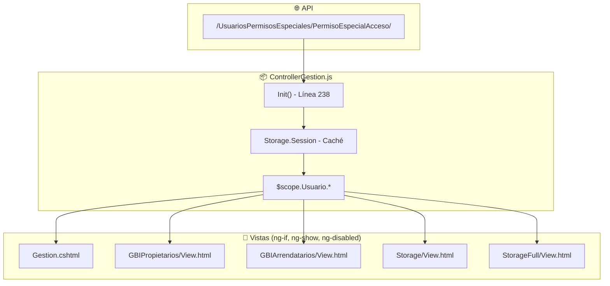

# Documentación de Permisos Especiales - Centro de Gestión Comercial

## Resumen

Este documento detalla los **16 permisos especiales** que controlan la visibilidad y funcionalidad de opciones en el módulo "Centro de Gestión Comercial" (Ruta: `CRM/PreContactos/Gestion`).

Los permisos se cargan desde la API `/UsuariosPermisosEspeciales/PermisoEspecialAcceso/` al inicializar el controlador y se almacenan en el objeto `$scope.Usuario` para su uso en las vistas.

---

## Ubicación del Código de Carga de Permisos

**Archivo:** `js/Areas/CRM/PreContactos/ControllerGestion.js`
**Líneas:** 262-310

```javascript
// Llamada a la API para obtener permisos especiales
Services.Async(
  $scope.serviceBaseSIS + "UsuariosPermisosEspeciales/PermisoEspecialAcceso/",
  {
    UsuarioID: $scope.Usuario.UsuarioID,
    Ruta: window.location.pathname,
    ModuloID: 8,
    Token: $scope.Usuario.Token,
  },
  function (response) {
    // Mapeo de permisos a propiedades del Usuario
    // ...
  },
);
```

---

## Tabla de Permisos Especiales

| ID  | Variable en Código                   | Nombre del Permiso                                                         | Estado                 |
| --- | ------------------------------------ | -------------------------------------------------------------------------- | ---------------------- |
| 1   | `Usuario.FiltroSucursal`             | Mostrar filtro de sucursal                                                 | ✅ Implementado        |
| 2   | `Usuario.FiltroAsesor`               | Mostrar filtro de asesor                                                   | ✅ Implementado        |
| 3   | `Usuario.Asignable`                  | Asignar asesor                                                             | ✅ Implementado        |
| 4   | `Usuario.PermiteEdicionInmueble`     | Edición de inmueble                                                        | ✅ Implementado        |
| 5   | `Usuario.PermiteEliminarActividades` | Permite eliminación de actividades                                         | ✅ Implementado        |
| 6   | `Usuario.PermitePublicacionPortales` | Permite la publicación de los inmuebles en los portales                    | ✅ Implementado        |
| 7   | `Usuario.EliminacionLeads`           | Permite la eliminación del contacto o lead                                 | ✅ Implementado        |
| 8   | `Usuario.EliminacionInmuebles`       | Permite la eliminación de los inmuebles                                    | ✅ Implementado        |
| 9   | `Usuario.PermiteEdicionActividades`  | Permite la edición de las actividades                                      | ✅ Implementado        |
| 10  | `Usuario.EdicionEstadoProceso`       | Permite la modificación del estado del proceso                             | ✅ Implementado        |
| 11  | `Usuario.EdicionLineaTiempo`         | Permite la modificación de la linea automatica                             | ✅ Implementado        |
| 12  | ❌ No implementado                   | Permite creacion directa de inmueble sin hacer todo el proceso comercial   | ⚠️ **NO IMPLEMENTADO** |
| 13  | `Usuario.PermiteQuitarFirmaActa`     | Habilitar boton quitar la firma del acta de entrega del inmueble           | ✅ Implementado        |
| 14  | `Usuario.PermiteQuitarInventario`    | Habilitar boton quitar inventario del inmueble                             | ✅ Implementado        |
| 15  | `Usuario.PermiteCargarInventario`    | Habilitar boton cargar inventario del inmueble                             | ✅ Implementado        |
| 16  | `Usuario.PermiteEditarOrdenServicio` | (GESTIÓN DE ORDENES DE SERVICIO) Permitir realizar modificaciones a la ODS | ✅ Implementado        |

---

## Detalle de Cada Permiso

### 1. Mostrar filtro de sucursal (`FiltroSucursal`)

**PermisoEspecialMenuID:** 1

**Mapeo en código:**

```javascript
// ControllerGestion.js:282, 305
$scope.Usuario.FiltroSucursal = $filter("filter")(
  response.rows,
  function (elem) {
    return elem.PermisoEspecialMenuID == 1;
  },
  true,
)[0].Acceso;
```

**Uso en vistas:** Controla la visibilidad del filtro de sucursal en la barra de filtros de la tabla de PreContactos.

---

### 2. Mostrar filtro de asesor (`FiltroAsesor`)

**PermisoEspecialMenuID:** 2

**Mapeo en código:**

```javascript
// ControllerGestion.js:281, 304
$scope.Usuario.FiltroAsesor = $filter("filter")(
  response.rows,
  function (elem) {
    return elem.PermisoEspecialMenuID == 2;
  },
  true,
)[0].Acceso;
```

**Uso en vistas:**

- **Gestion.cshtml:729** - `ng-show="Usuario.FiltroAsesor == true"` - Muestra/oculta el filtro de asesor en la tabla de actividades del calendario.

---

### 3. Asignar asesor (`Asignable`)

**PermisoEspecialMenuID:** 3

**Mapeo en código:**

```javascript
// ControllerGestion.js:280, 303
$scope.Usuario.Asignable = $filter("filter")(
  response.rows,
  function (elem) {
    return elem.PermisoEspecialMenuID == 3;
  },
  true,
)[0].Acceso;
```

**Uso en vistas:**

- **Gestion.cshtml:307** - `ng-if="Usuario.Asignable == true || PreContacto.ProcesoID == null"` - Habilita la selección de asesor en el formulario de nuevo PreContacto.
- **StorageFull/View.html:403-406** - Controla si el dropdown de asesor es editable o solo lectura.
- **Storage/View.html:339-342** - Similar comportamiento para Storage estándar.

---

### 4. Edición de inmueble (`PermiteEdicionInmueble`)

**PermisoEspecialMenuID:** 4

**Mapeo en código:**

```javascript
// ControllerGestion.js:279, 302
$scope.Usuario.PermiteEdicionInmueble = $filter("filter")(
  response.rows,
  function (elem) {
    return elem.PermisoEspecialMenuID == 4;
  },
  true,
)[0].Acceso;
```

**Uso en vistas:**

- **GBIPropietarios/View.html:264** - `ng-disabled="!Usuario.PermiteEdicionInmueble"` - Botón "Editar información del inmueble".

**Uso en controladores:**

- **GBIPropietarios/ControllerGBIPropietarios.js:746** - Retorna si se permite edición en el menú contextual.

---

### 5. Permite eliminación de actividades (`PermiteEliminarActividades`)

**PermisoEspecialMenuID:** 5

**Mapeo en código:**

```javascript
// ControllerGestion.js:278, 301
$scope.Usuario.PermiteEliminarActividades = $filter("filter")(
  response.rows,
  function (elem) {
    return elem.PermisoEspecialMenuID == 5;
  },
  true,
)[0].Acceso;
```

**Uso en controladores:**

- **ControllerGestion.js:2293** - Controla visibilidad del menú contextual "Eliminar actividad" en las actividades del proceso.
- **ControllerGestion.js:2805** - Similar control para el calendario de actividades general.

---

### 6. Permite la publicación de los inmuebles en los portales (`PermitePublicacionPortales`)

**PermisoEspecialMenuID:** 6

**Mapeo en código:**

```javascript
// ControllerGestion.js:277, 300
$scope.Usuario.PermitePublicacionPortales = $filter("filter")(
  response.rows,
  function (elem) {
    return elem.PermisoEspecialMenuID == 6;
  },
  true,
)[0].Acceso;
```

**Uso en vistas:**

- **GBIPropietarios/View.html:265** - `ng-disabled="!Usuario.PermitePublicacionPortales"` - Botón "Publicar inmueble en plataformas".

**Uso en controladores:**

- **GBIPropietarios/ControllerGBIPropietarios.js:767** - Controla visibilidad en menú contextual.

---

### 7. Permite la eliminación del contacto o lead (`EliminacionLeads`)

**PermisoEspecialMenuID:** 7

**Mapeo en código:**

```javascript
// ControllerGestion.js:276, 299
$scope.Usuario.EliminacionLeads = $filter("filter")(
  response.rows,
  function (elem) {
    return elem.PermisoEspecialMenuID == 7;
  },
  true,
)[0].Acceso;
```

**Uso en controladores:**

- **ControllerGestion.js:2149** - Controla la opción "Eliminar contacto" en el menú contextual de la tabla/timeline.

---

### 8. Permite la eliminación de los inmuebles (`EliminacionInmuebles`)

**PermisoEspecialMenuID:** 8

**Mapeo en código:**

```javascript
// ControllerGestion.js:275, 298
$scope.Usuario.EliminacionInmuebles = $filter("filter")(
  response.rows,
  function (elem) {
    return elem.PermisoEspecialMenuID == 8;
  },
  true,
)[0].Acceso;
```

**Uso en controladores:**

- **GBIPropietarios/ControllerGBIPropietarios.js:824** - Controla la opción "Eliminar inmueble" en el menú contextual.

---

### 9. Permite la edición de las actividades (`PermiteEdicionActividades`)

**PermisoEspecialMenuID:** 9

**Mapeo en código:**

```javascript
// ControllerGestion.js:274, 297
$scope.Usuario.PermiteEdicionActividades = $filter("filter")(
  response.rows,
  function (elem) {
    return elem.PermisoEspecialMenuID == 9;
  },
  true,
)[0].Acceso;
```

**Uso en controladores:**

- **ControllerGestion.js:2281** - `$itemScope.item.Completada == false && $scope.Usuario.PermiteEdicionActividades == true` - Controla opción "Editar actividad" solo si no está completada.
- **ControllerGestion.js:2778** - Similar control en el calendario general (solo para actividades sin ProcesoID).

---

### 10. Permite la modificación del estado del proceso (`EdicionEstadoProceso`)

**PermisoEspecialMenuID:** 10

**Mapeo en código:**

```javascript
// ControllerGestion.js:273, 296
$scope.Usuario.EdicionEstadoProceso = $filter("filter")(
  response.rows,
  function (elem) {
    return elem.PermisoEspecialMenuID == 10;
  },
  true,
)[0].Acceso;
```

**Uso en controladores:**

- **ControllerGestion.js:2103** - Controla la opción "Cambiar estado del proceso" en el menú contextual.

---

### 11. Permite la modificación de la linea automatica (`EdicionLineaTiempo`)

**PermisoEspecialMenuID:** 11

**Mapeo en código:**

```javascript
// ControllerGestion.js:272, 295
$scope.Usuario.EdicionLineaTiempo = $filter("filter")(
  response.rows,
  function (elem) {
    return elem.PermisoEspecialMenuID == 11;
  },
  true,
)[0].Acceso;
```

**Uso en vistas:**

- **Gestion.cshtml:163** - `ng-if="Usuario.EdicionLineaTiempo == true"` - Muestra el botón de bloquear/desbloquear proceso en la vista de línea de tiempo (vista de columnas).

---

### 12. Permite creación directa de inmueble sin hacer todo el proceso comercial

**PermisoEspecialMenuID:** 12

> ⚠️ **IMPORTANTE:** Este permiso está definido en la base de datos pero **NO ESTÁ IMPLEMENTADO** en el código del frontend. No existe ninguna referencia a `PermisoEspecialMenuID == 12` en los archivos del módulo CRM.

---

### 13. Habilitar botón quitar la firma del acta de entrega del inmueble (`PermiteQuitarFirmaActa`)

**PermisoEspecialMenuID:** 13

**Mapeo en código:**

```javascript
// ControllerGestion.js:285, 308
$scope.Usuario.PermiteQuitarFirmaActa = $filter("filter")(
  response.rows,
  function (elem) {
    return elem.PermisoEspecialMenuID == 13;
  },
  true,
)[0].Acceso;
```

**Uso en vistas:**

- **GBIArrendatarios/View.html:441** - `ng-if="Usuario.PermiteQuitarFirmaActa"` - Muestra botón "Quitar firma" en la sección de Acta de Entrega del contrato de arrendamiento.

---

### 14. Habilitar botón quitar inventario del inmueble (`PermiteQuitarInventario`)

**PermisoEspecialMenuID:** 14

**Mapeo en código:**

```javascript
// ControllerGestion.js:284, 307
$scope.Usuario.PermiteQuitarInventario = $filter("filter")(
  response.rows,
  function (elem) {
    return elem.PermisoEspecialMenuID == 14;
  },
  true,
)[0].Acceso;
```

**Uso en vistas:**

- **GBIPropietarios/View.html:292** - `ng-if="Usuario.PermiteQuitarInventario"` - Botón "Quitar" inventario del inmueble captado.
- **GBIArrendatarios/View.html:412** - `ng-if="Usuario.PermiteQuitarInventario"` - Botón "Quitar" inventario de entrega del contrato.

---

### 15. Habilitar botón cargar inventario del inmueble (`PermiteCargarInventario`)

**PermisoEspecialMenuID:** 15

**Mapeo en código:**

```javascript
// ControllerGestion.js:283, 306
$scope.Usuario.PermiteCargarInventario = $filter("filter")(
  response.rows,
  function (elem) {
    return elem.PermisoEspecialMenuID == 15;
  },
  true,
)[0].Acceso;
```

**Uso en vistas:**

- **GBIPropietarios/View.html:291** - `ng-disabled="item.InmuebleInventarioID == null || (item.RutaInventario != null && !Usuario.PermiteCargarInventario)"` - Botón "Cargar" se deshabilita si ya existe un inventario y el usuario no tiene el permiso.
- **GBIArrendatarios/View.html:411** - Similar comportamiento para el inventario de entrega del contrato.

---

### 16. (GESTIÓN DE ORDENES DE SERVICIO) Permitir realizar modificaciones a la ODS (`PermiteEditarOrdenServicio`)

**PermisoEspecialMenuID:** 16

**Mapeo en código:**

```javascript
// ControllerGestion.js:286, 309
$scope.Usuario.PermiteEditarOrdenServicio = $filter("filter")(
  response.rows,
  function (elem) {
    return elem.PermisoEspecialMenuID == 16;
  },
  true,
)[0].Acceso;
```

**Uso en vistas:**

- **Storage/View.html:797** - Controla si el formulario de Orden de Servicio está habilitado o deshabilitado según el estado.
- **Storage/View.html:1499** - Controla si el botón "Guardar" de la ODS está habilitado.

**Uso en controladores:**

- **Storage/ControllerStorage.js:1632, 1658** - Validaciones adicionales al guardar/actualizar ODS.

---

## Diagrama de Arquitectura de Permisos



---

## Notas Importantes

1. **Caché de Sesión:** Los permisos se cachean en `Storage.Session` para evitar llamadas repetidas a la API durante la misma sesión.

2. **ModuloID:** Todos estos permisos pertenecen al Módulo ID = 8 (CRM).

3. **Permiso no implementado:** El permiso ID 12 ("Creación directa de inmueble") existe en la base de datos pero no tiene ninguna implementación en el código frontend.

4. **Directivas Angular utilizadas:**
   - `ng-if="Usuario.X == true"` - Oculta/muestra el elemento del DOM completamente.
   - `ng-show="Usuario.X"` - Muestra/oculta visualmente pero mantiene en el DOM.
   - `ng-disabled="!Usuario.X"` - Deshabilita el elemento pero lo mantiene visible.

---

_Documento generado el 19 de enero de 2026_
